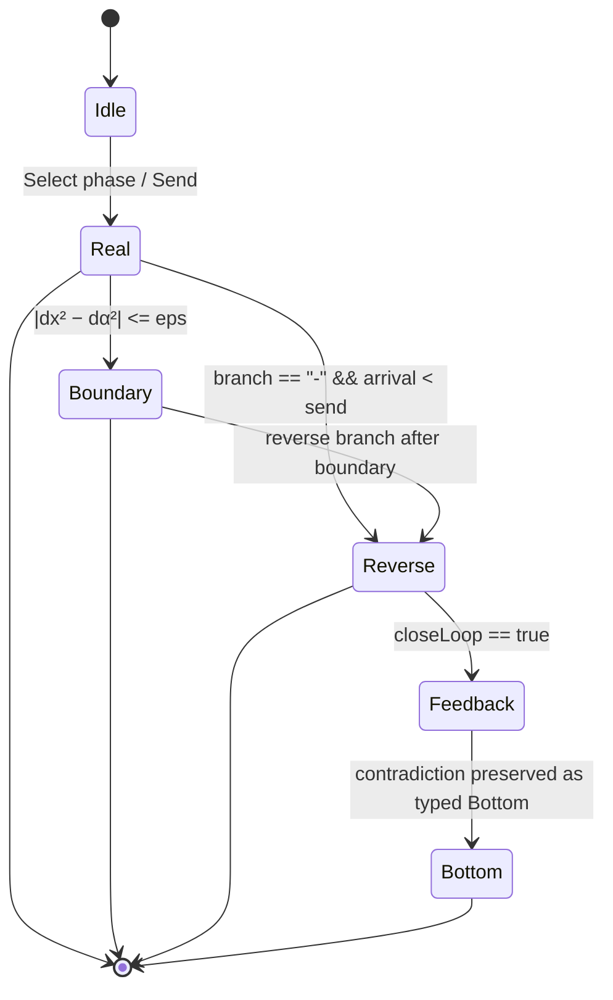
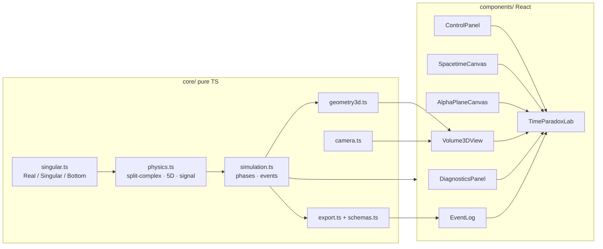

# TimeParadoxLab 3D — 5D Singularity Spacetime Simulator

A research **visualization** + **typed singular state machine** for the
split-complex / α-axis singularity model, now with an interactive **3D `(x, t, α)`
volume** (Three.js) alongside the original 2D slices.

> **Honesty boundary (important).** This is a research visualization, *not* a
> claim of verified new physics.
> - The split-complex unit `j` (`j²=1`) is ordinary commutative algebra — it is
>   *not* `1/0`.
> - A division-by-zero / boundary event is a **typed singular object** (tag
>   operator `D0(a)=a#`, graded by order λ). There is no honest ring element `K`
>   with `0·K=1`; we never coerce a singularity to `∞`. A feedback contradiction
>   is the typed **`Bottom`**, *not* a synthetic infinite order.
> - `ds² = c²dt² − dx² − dy² − dz² + dα²` has **two timelike directions**. The
>   α-axis is a *modeling coordinate for singular structure*, a speculative
>   kinematics — not a conservative extension of special relativity.

---

## Run it

### A) Offline standalone (no toolchain — recommended right now)

Open **`standalone.html`** in a browser (double-click works). React, ReactDOM,
**Three.js** and Babel are vendored in `vendor/`, so it runs fully offline; the
TypeScript is transpiled in-browser at load. If your browser is strict about
`file://`:

```bash
python -m http.server 8000      # then open http://localhost:8000/standalone.html
```

`standalone.html` is **generated from the same `src/` TypeScript** by:

```bash
python build_standalone.py
```

### B) Proper dev project (when Node is available)

```bash
npm install
npm run dev        # Vite dev server
npm run build      # tsc --noEmit && vite build
npm test           # Vitest — runs the WO acceptance criteria headlessly
```

### C) Verify without Node (optional)

`verify.py` transpiles the whole bundle through the vendored Babel inside a small
embedded JS engine, executes the real self-tests, and server-renders the full
React tree:

```bash
pip install py_mini_racer
python verify.py
```

Latest result: **bundle transpiles clean · 24/24 self-tests pass · SSR renders all six panels.**

---

## The six panels

| Panel | What it shows |
|-------|---------------|
| **Controls** | phases, α (slider + number), branch, close-loop, scenario, transport, **camera presets**, **3D layer toggles**, self-tests, help |
| **Spacetime `(x,t)`** | Bob/Alice worldlines, light cone, signal path, reverse arrivals in red |
| **Alpha-plane `(x,α)`** | split-complex null lines `α=±x`, teal/magenta wedges, pulsing boundary marker |
| **3D Volume `(x,t,α)`** | orbit camera, singular planes `α=±x`, null surfaces from the send event, worldlines, signal path, slice shadows, hover/click linking |
| **Diagnostics** | `Δ_split`, `Δ₅D`, `γ₅D`, domains, typed `dt_signal`, typed arrival, escalation order λ, contradictions + a plain-language summary |
| **Event log** | colour-coded events, clickable (cross-panel linking), **Export JSON** |

---

## Escalation ladder (state machine)



```
order 0   Real                          ordinary propagation
order ½   BOUNDARY_TOUCH (Singular)      dx²=dα²  or  Δ₅D≈0
order 1   REVERSE_ARRIVAL (Singular,−)   arrival before send (kept as data)
⊥         FEEDBACK_CONTRADICTION         a reply closes a causal loop  →  Bottom
```

Contradictions are **preserved as data** (`Bottom`/`Singular`), never hidden or
coerced to `∞`. `order` stays finite even at the contradiction; the `Bottom`
value carries the escalation.

## Architecture / data flow



---

## The model (three separated layers)

**1 — Geometry (split-complex):** `z = x + jα`, `j²=1`, norm `N(z)=x²−α²`; the
inverse fails exactly on `α=±x` — a zero-divisor boundary locus.

**2 — 5D diagnostic (speculative kinematics):**
`u=dα/dt`, `Δ₅D = 1 − (v²−u²)/c²`, `γ₅D = 1/√Δ₅D` (order ½ as `Δ₅D→0`).

**3 — Signal / paradox:** from `0 = c²dt² − dx² + dα²`,
`|dt_signal| = √(max(0, dx² − dα²)) / c`. Both `+`/`−` branches are available; a
`−` arrival before the send time is a reverse causal event.

### 3D geometry (see `docs/diagrams/singular-volume.md`)

- **Singular planes** `Π± : α = ±x`, ruled along `t` — translucent red meshes.
- **Null surfaces** `(x−x_s)² − (α−α_s)² = (cτ)²` from the send event — two
  triangulated sheets (always real, never NaN: `rad = (cτ)² + (α−α_s)² ≥ 0`).
- **Signal path** send→arrival — a didactic aid, *not* a physical geodesic.

### Typed values & JSON schema

```ts
Real(value)
Singular(coeff, order, branch, reason)   // branch ∈ plain | + | − | loop | feedback | mixed
Bottom(reason)
```

Events serialize to `EventLogExport` and validate against the schemas in
`src/core/schemas.ts` (`sim-event.schema.json` etc.). A reverse-arrival fixture:

```json
{
  "id": "evt-0003", "seq": 3, "type": "REVERSE_ARRIVAL", "level": "singular",
  "phaseId": "paradox", "message": "Alice receives before Bob sends",
  "scenario": { "xBob": 0, "xAlice": 5, "tSend": 2, "c": 1, "eps": 1e-6,
                "alpha": 4.898979485566356, "branch": "-", "closeLoop": false },
  "typedState": { "kind": "Singular", "coeff": 1, "order": 1, "branch": "-", "reason": "reverse arrival" },
  "arrival": { "kind": "Real", "value": 1 },
  "payload": { "send": [0,2,0], "arrival": [5,1,4.898979485566356], "deltaSignal": 1 }
}
```

---

## Kidi Light-Speed Projection

A fourth panel turns the existing signal law into an **equivalent projected speed**.
`c` stays a constant reference (drawn as the glowing `β = 1` plane — never a free
coordinate); `W` is a **display alias** of the existing `α` axis.

```
deltaSignal = dx² − dW²
v_equiv = c·|dx| / √deltaSignal      β_equiv = v_equiv/c = 1/√(1−η²)
η = |dW|/|dx|        ρ = 1 − η² = deltaSignal/dx²
```

Classification is **tolerance-based** (never exact `dW=0` / `|dW|=|dx|`):

| condition | class | β_equiv |
|---|---|---|
| `|dx| ≤ ε` | `UNDEFINED_DX` | `Bottom` |
| `η ≤ ηₘᵢₙ` | `LIGHT_SPEED` | `Real(1)` |
| `ηₘᵢₙ < η < 1−tol` | `PROJECTED_SUPERLUMINAL` | `Real(>1)` |
| `|η−1| ≤ tol` | `KIDI_BOUNDARY` | `Singular(|dx|, ½)` |
| `η > 1+tol` | `W_DOMAIN_NO_REAL_DT` | `Singular(½)`, **not a real speed** |

> The Kidi Light-Speed Projection panel does not claim verified real-world
> faster-than-light travel. It shows an equivalent 3D projected speed inside the
> simulator's speculative 5D null geometry. When the W/α component is nonzero but
> still within the real projection domain, the projected speed can exceed c. When
> |W| approaches |dx|, the model reaches a Kidi Boundary. When |W| exceeds |dx|,
> the projected travel time is no longer real under this model.

`Kidi` is the user-facing name for typed singular boundary states; the internal
algebra stays `Singular` / `Bottom` for code stability.

## Light-Speed Reference Baseline

TimeParadoxLab renders an ordinary α=0 light-speed path from Bob to Alice:

```
dt_light = |dx|/c        t_light_arrival = t_send + |dx|/c
```

This baseline is **not a photon rest frame** and **not a new coordinate system**.
It is a fixed comparison ruler. It lets users compare the ordinary light path
against the current W/α path. It is drawn as a cyan dashed ray in the spacetime
slice and on the α=0 plane in the 3D volume, and toggled with "Show light-speed
baseline" (default on).

When the current W/α signal arrives earlier than the α=0 baseline, the app labels
that as projected superluminal behavior inside the speculative model, not verified
real-world faster-than-light travel.

Per phase (Bob 0, Alice 5, send 2, c 1): ordinary α=0 → current overlaps baseline
(t=7); shortcut α=4 → arrives 2 before baseline; boundary α=5 → Kidi Boundary while
baseline stays t=7; paradox (−) → reverse arrival t=1 while the baseline stays
forward-causal at t=7.

## Reduced Kidi Corridor Feasibility Field (V–W Correlation)

This module does **not** require the full 5D time-paradox layer (no negative time,
no reverse branch, no feedback paradox). It is a reduced kinematic feasibility
layer using `D, W, V, c, t`. The time-paradox module remains an optional advanced
exploration layer.

Can a *local* corridor speed below light speed still arrive before the ordinary α=0
light baseline, because the W/α corridor shortens the effective distance? The
**Kidi V–W Correlation Field** panel answers this continuously.

```
D = |dx|     η = |W|/D     β = V/c        (V is the local sub-c corridor speed)
t_light  = D/c
D_eff    = D·√(1−η²)
t_sub-c  = D_eff/V = D·√(1−η²)/(βc)
```

The corridor beats the light baseline when `t_sub-c < t_light`, i.e.

```
β > √(1−η²)        ⇔        β² + η² > 1
```

The panel plots η (x-axis) vs β (y-axis) with the boundary curve **β² + η² = 1**:
below it is `SUBC_TOO_SLOW`, above it (β<1, η<1) is `SUBC_BEATS_LIGHT`, on it is
`EQUAL_TO_LIGHT_BASELINE`; η=1 is the `KIDI_BOUNDARY`, η>1 is `NO_REAL_CORRIDOR`.
The live (η, β) point moves with the W (α) and V (β_sub) controls.

**Insight:** higher W lowers the required V, and higher V lowers the required W.
For `D=5, V=0.8c`: `W=4` ⇒ β²+η²=1.28 ⇒ beats light (t_sub-c=3.75 < 5); `W=2` ⇒
0.80 ⇒ too slow; `W=3` ⇒ exactly 1.0 ⇒ equal to the baseline.

This does **not** claim matter exceeds light speed locally — V stays below c. The
earlier arrival is the model's geometric shortening through the W/α corridor.

## Keyboard & accessibility

`Space` play/pause · `R` reset · `1–5` phases · `E` export JSON · `C` cycle camera
· `L` history trails · `?` help · drag = orbit · shift/right-drag = pan · wheel =
zoom · click marker / event = cross-panel select.

Every slider has a numeric textbox twin; layers/events are focusable; the 3D scene
has an `aria-label` and a live plain-language summary region; no meaning is
conveyed by colour alone (state labels are always shown as text).

---

## Built-in demo (Bob x=0, Alice x=5, send t=2, c=1)

| Phase | α | branch | arrival | typed state |
|-------|-----|--------|---------|-------------|
| Ordinary | 0 | + | **t=7** | Real |
| Mild shortcut | 4 | + | **t=5** | Real |
| Boundary touch | 5 | + | t=2 | Singular(½) |
| Paradox | √24 | − | **t=1** | Singular(1, −) |
| Feedback | √24 | − (reply) | ⊥ | Bottom |

All asserted by `src/core/selfTest.ts` (run from the UI, `npm test`, or `verify.py`).

---

## File map

```
src/core/    singular · physics · simulation · schemas · export · geometry3d ·
             camera · projection · colorRules · useElementSize · selfTest
src/components/  TimeParadoxLab + ControlPanel · SpacetimeCanvas · AlphaPlaneCanvas ·
                 Volume3DView · VolumeLegend · LayerToggleGroup · HoverInspector ·
                 HelpOverlay · DiagnosticsPanel · EventLog
build_standalone.py   generates standalone.html from src/ (no Node)
standalone.html       offline, double-clickable build
vendor/               React · ReactDOM · Three.js · Babel (vendored, offline)
docs/diagrams/        labeled 3D geometry diagram
docs/screenshots/     drop UI screenshots here
```

## Scope

Local-first, frontend-only. No backend, database, or server-side engine. The 3D
view augments — it does not replace — the 2D slices, which remain the most legible
exact-reading views and the accessibility fallback. A future Newton–Puiseux branch
decomposition module (per the uploaded note) is an intentional later extension.
# timeparadoxlab-kidi

