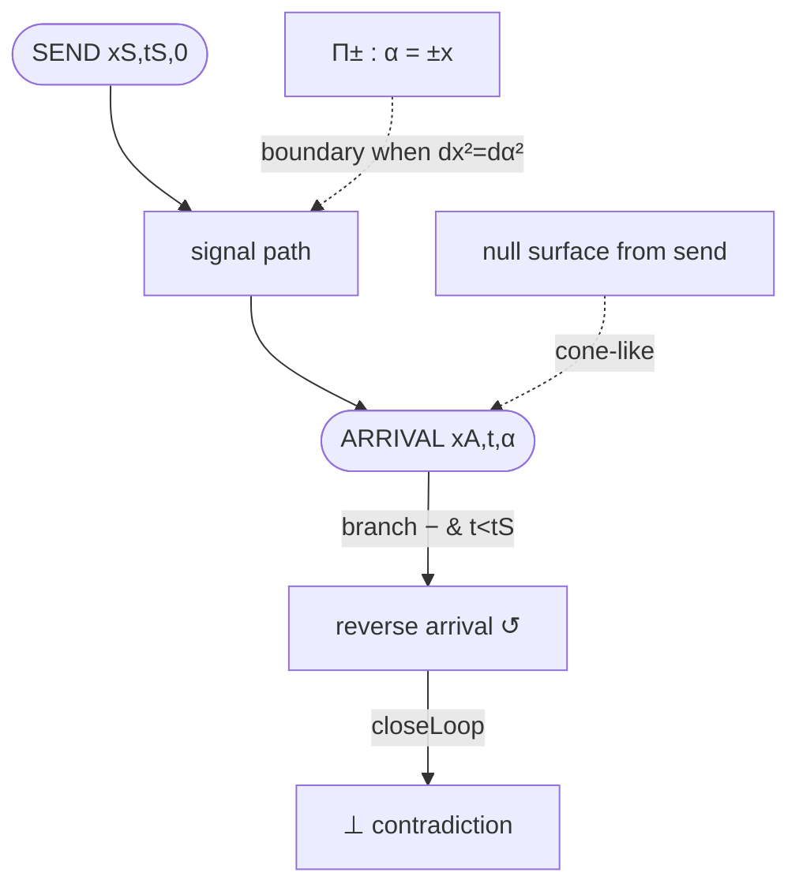

# The 3D singular volume `(x, t, α)` — labeled diagram

Scene convention (right-handed): **X = x** (space), **Y = t** (time), **Z = α** (alpha).

## Singular planes `α = ±x` and the null surface from the send event

```
                         t (Y, up)
                          ^
                          |          Π+ : α = +x        (translucent red)
                          |        /
        Alice worldline   |      /   .  null surface sheet
        (x = xA)          |    /  .       (x−xS)² − (α−αS)² = (cτ)²
            |             |  / .
            |             |/.
   ---------+-------------●----------------------> x (X)
            |          (SEND: xS, tS, 0)   \
            |                                \
        Bob worldline                         \  Π− : α = −x
        (x = xB)                                \
                          |  (depth into page = α, Z axis)
                          v
```

- **Π₊ (α = x)** and **Π₋ (α = −x)** are the split-complex null loci
  `x² − α² = 0`, ruled along the time axis `t` → two transparent planes.
- The **null surface** `(x − xS)² − (α − αS)² = (cτ)²` (τ = t − tS) is sampled into
  two hyperbolic sheets. Because `rad = (cτ)² + (α − αS)² ≥ 0`, the sampled
  `x = xS ± √rad` is always real — **no NaN vertices**.
- The **signal path** is the segment SEND → ARRIVAL. It is a didactic aid, *not* a
  claim of a physical geodesic.
- **Slice shadows** project the signal onto the `x–t` wall (`α = αₘᵢₙ`) and the
  `x–α` wall (`t = tₘᵢₙ`) so the 2D slices and the 3D volume stay legible together.

## Domain colouring (consistent across 2D and 3D)

| `Δ_split = x² − α²` | domain | colour |
|---|---|---|
| `> ε` | REAL_DOMAIN | teal `#56e39f` |
| `|·| ≤ ε` | SINGULAR_BOUNDARY | amber `#ffd23b` (pulses) |
| `< −ε` | ALPHA_DOMAIN | magenta `#e23bd0` |

Where the signal hits a singular boundary (`dx² = dα²`), the loci planes pulse and
the marker is emphasised; a reverse arrival is dashed/red; a feedback contradiction
shows a `⊥` glyph.

